# Parte 1 — Entornos de trabajo con Scala

## Autor

Jesús Martínez de la Casa

## Entorno utilizado

Trabajamos en Windows 11 con Scala 2.12.21 y Azul Zulu JDK 17.0.20.1. Preparamos tres entornos:

| Entorno | Versiones utilizadas |
| --- | --- |
| JupyterLab + Almond | Python 3.12.10, JupyterLab 4.6.3 y Almond 0.14.5; navegador Google Chrome |
| Visual Studio Code + Metals | VS Code 1.137.0, extensión Metals 1.71.0 y sbt 1.13.0 |
| IntelliJ IDEA Community + sbt | IntelliJ 2024.3.1.1, plugin Scala 2024.3.35 y sbt 1.10.3 |

El enunciado pide Scala 2.12.21 y JDK 17. Para el resto de herramientas usamos las versiones que aparecen en la tabla.

## 1.1 JupyterLab + Almond Kernel

### Requisitos e instalación

Empezamos creando un entorno virtual desde PowerShell. Así dejamos los paquetes de la práctica separados del Python general del equipo:

```powershell
python -m venv C:\clase3\.venv
```

Creamos el entorno con Python 3.12.10, que ya tenemos instalado.

Después instalamos JupyterLab con el Python de ese entorno:

```powershell
C:\clase3\.venv\Scripts\python.exe -m pip install jupyterlab
```

Esperamos a que termine la instalación. Vemos el mensaje Successfully installed y comprobamos que queda instalada la versión 4.6.3.

Para abrir JupyterLab, entramos en `C:\clase3\.venv\Scripts` y ejecutamos:

```powershell
.\python.exe -m jupyterlab --notebook-dir=C:\clase3
```

Con este comando indicamos que la carpeta de trabajo es C:\clase3. Dejamos PowerShell abierto para que JupyterLab siga funcionando.

Al abrirse en Opera, la página se queda cargando. Copiamos el enlace de la terminal en Google Chrome y ahí podemos entrar en JupyterLab.

Dentro de JupyterLab abrimos la carpeta `workspace`. Todavía está vacía y en el Launcher solo aparece Python, así que el siguiente paso es añadir Scala.

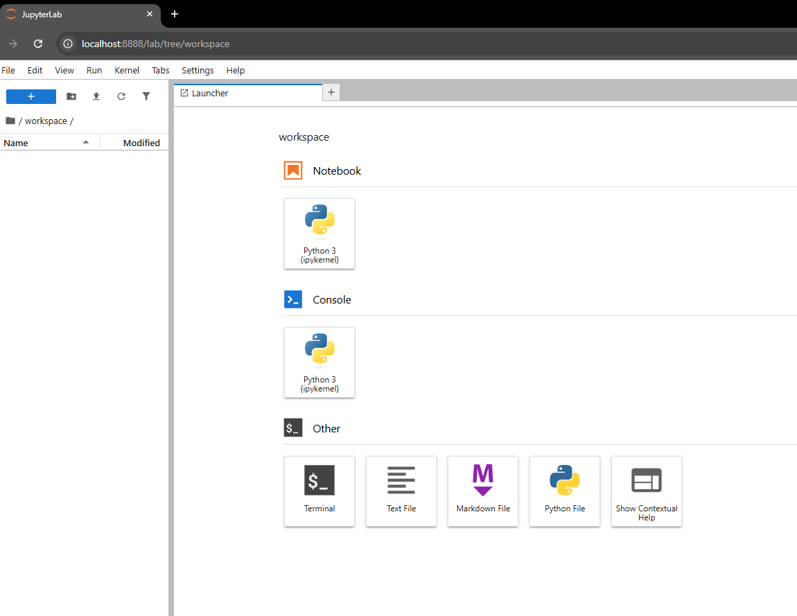

### Comprobación inicial de Java

Antes de preparar Almond, comprobamos las versiones de Java desde otra ventana de PowerShell:

```powershell
java -version
javac -version
```

Aquí aparece el primer problema: `java` muestra Java 8 y `javac` muestra Java 21. No están usando la misma instalación y ninguno muestra Java 17. Antes de instalar nada, revisamos de dónde sale cada comando.

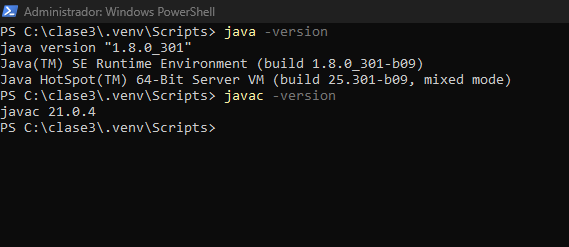

Para conocer el origen de esta diferencia, localizamos los ejecutables que PowerShell está utilizando:

```powershell
Get-Command java, javac | Select-Object Name, Source
```

`java.exe` sale de `C:\Program Files (x86)\Common Files\Oracle\Java\javapath`, mientras que `javac.exe` está en `C:\Program Files\Zulu\zulu-21\bin`. Eso explica por qué aparecen versiones diferentes.

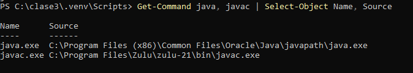

Después listamos las instalaciones disponibles en las carpetas habituales:

```powershell
Get-ChildItem "C:\Program Files\Zulu","C:\Program Files\Java" -Directory -ErrorAction SilentlyContinue | Select-Object FullName
```

Encontramos Zulu JDK 21, Oracle JDK 8 y Oracle JRE 8. No aparece ninguna instalación de JDK 17, por lo que necesitamos instalar esa versión para cumplir el requisito de la práctica.

En la página oficial de Azul seleccionamos Java 17 LTS, Windows, arquitectura x86 de 64 bits y el paquete JDK. Elegimos el instalador MSI para utilizar el asistente de instalación de Windows. La descarga corresponde a Azul Zulu 17.68.203, OpenJDK 17.0.20.1+1:

```text
zulu17.68.203-ca-jdk17.0.20.1-win_x64.msi
```

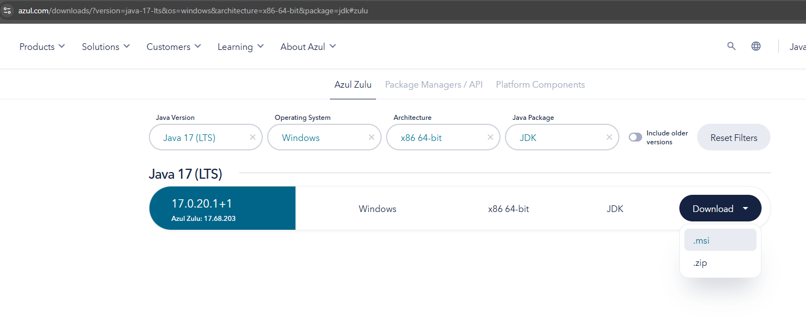

Abrimos el MSI para instalar el JDK 17 que acabamos de descargar.

En la configuración personalizada mantenemos activada la opción `Add to PATH` y activamos `Set JAVA_HOME variable`. Dejamos desactivada la modificación del registro JavaSoft de Oracle para no sobrescribir esa configuración. La instalación se realiza en `C:\Program Files\Zulu\zulu-17\`.

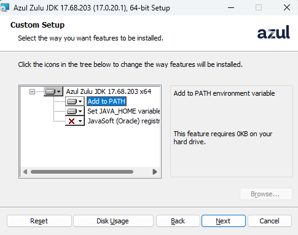

Pulsamos `Install` y aceptamos el permiso de Windows. Al terminar, el asistente confirma que Azul Zulu JDK 17.68.203, basado en OpenJDK 17.0.20.1 y de 64 bits, se ha instalado correctamente.

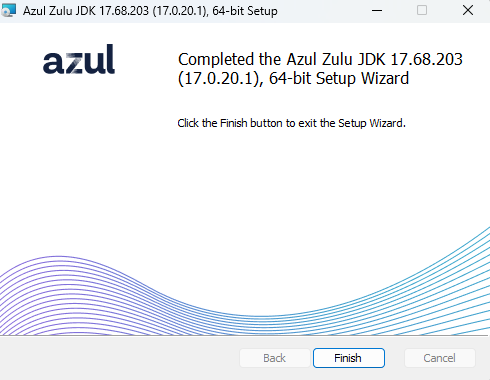

Después de instalarlo, la PowerShell que estamos usando todavía muestra la configuración anterior: `JAVA_HOME` apunta a Zulu 21, `java` da Java 8 y `javac` da Java 21. Revisamos las variables para comprobar qué ocurre.

Consultamos las variables del usuario y del sistema por separado. En el usuario no hay un `JAVA_HOME`, pero en el sistema ya apunta a `C:\Program Files\Zulu\zulu-17\`. Además, el `PATH` coloca `zulu-17\bin` antes que las otras versiones. Las variables guardadas están bien; falta comprobarlas en otra PowerShell.

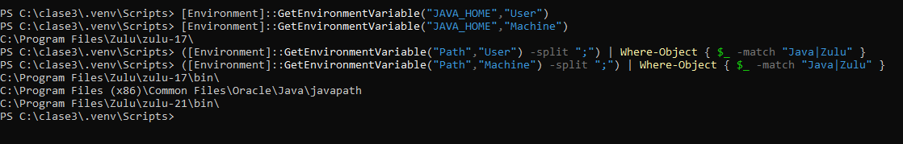

Abrimos otra PowerShell y repetimos la comprobación:

```powershell
$env:JAVA_HOME
java -version
javac -version
Get-Command java, javac | Select-Object Name, Source
```

Esta vez `JAVA_HOME` apunta a `C:\Program Files\Zulu\zulu-17\`, y tanto `java` como `javac` muestran la versión 17.0.20.1. Los dos ejecutables están en `C:\Program Files\Zulu\zulu-17\bin`. Con ello comprobamos que el entorno de esa terminal ya utiliza el JDK 17 exigido. No necesitamos reinstalarlo ni modificar manualmente las variables persistentes.

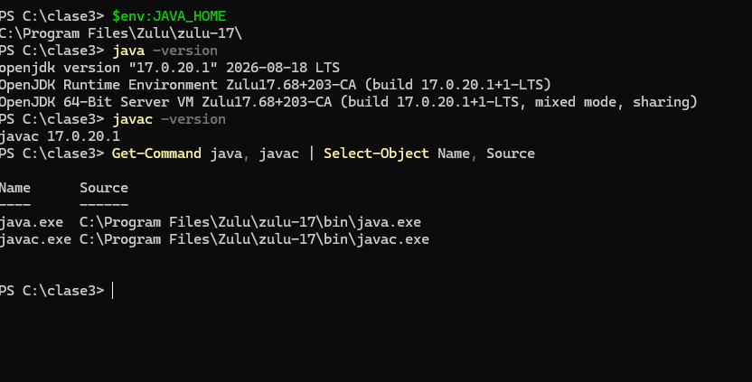

### Kernel y versión de Scala

Primero comprobamos si podemos utilizar Coursier desde PowerShell:

```powershell
cs --help
```

PowerShell no reconoce `cs`, así que descargamos Coursier para poder instalar Almond.

Descargamos el archivo `cs-x86_64-pc-win32.zip` para Windows de 64 bits desde el repositorio oficial de Coursier y lo guardamos en Descargas.

Extraemos el ZIP en el Escritorio. El ejecutable queda en `C:\Users\corre\OneDrive\Escritorio\cs-x86_64-pc-win32.exe`.

Lo ejecutamos desde PowerShell indicando su ruta completa:

```powershell
& "C:\Users\corre\OneDrive\Escritorio\cs-x86_64-pc-win32.exe" --help
```

Usamos `&` para ejecutar el archivo desde su ruta y `--help` para ver la ayuda. Al aparecer `Usage: coursier <COMMAND>` y la lista de comandos, comprobamos que Coursier ya funciona.

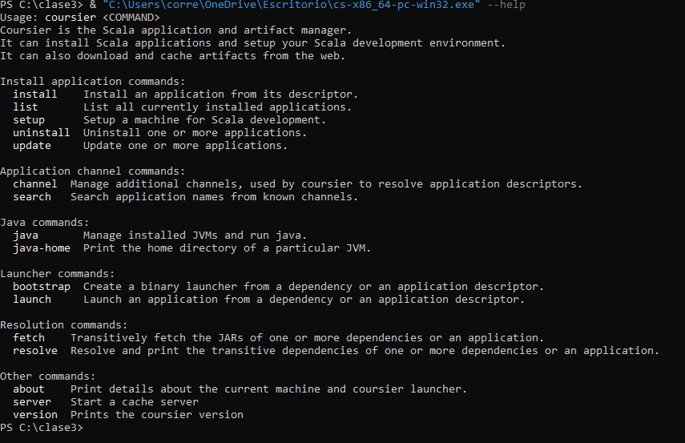

Instalamos Almond 0.14.5 indicando expresamente Scala 2.12.21:

```powershell
& "C:\Users\corre\OneDrive\Escritorio\cs-x86_64-pc-win32.exe" launch --use-bootstrap almond:0.14.5 --scala 2.12.21 -M almond.ScalaKernel -- --install
```

Coursier descarga las dependencias necesarias. La opción `--scala` fija la versión de Scala y `--install`, situada después de `--`, indica a Almond que registre el kernel en Jupyter. Al finalizar aparece `Installed scala kernel under C:\Users\corre\AppData\Roaming\jupyter\kernels\scala`, confirmando su instalación.

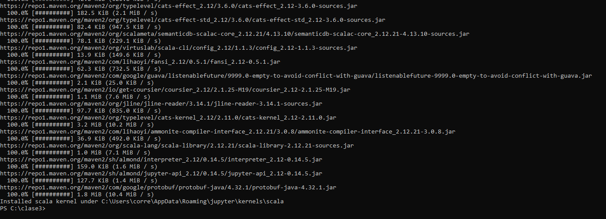

Recargamos JupyterLab en Chrome y abrimos el Launcher con el botón +. Comprobamos que aparece Scala tanto en Notebook como en Console. JupyterLab ya reconoce el kernel instalado.

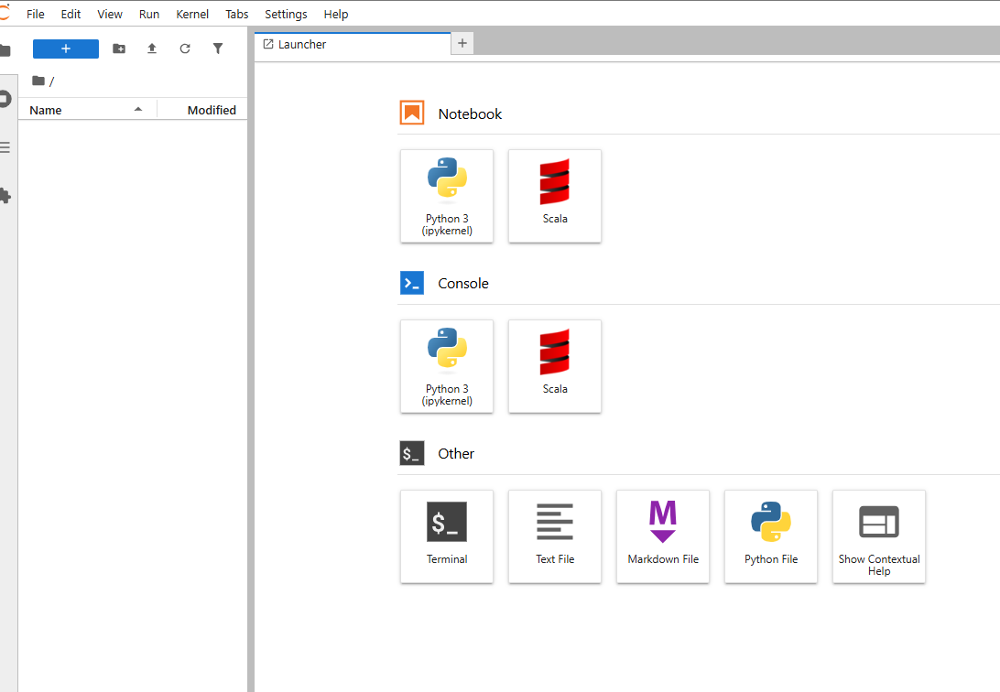

### Pruebas de funcionamiento

Abrimos un notebook Scala y consultamos las versiones con dos celdas:

```scala
println("Scala: " + scala.util.Properties.versionNumberString)
println("Java: " + System.getProperty("java.version"))
```

Scala ya muestra 2.12.21, pero Java sigue en 1.8.0_301. Aunque la nueva PowerShell utiliza Java 17, el notebook sigue funcionando con Java 8. Por eso reiniciamos JupyterLab desde la terminal correcta.

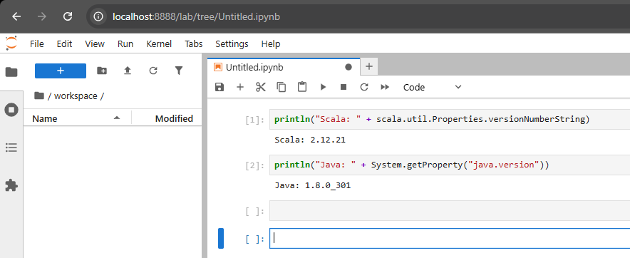

Guardamos el notebook y detenemos JupyterLab. En una PowerShell nueva comprobamos que `JAVA_HOME` apunta a Zulu 17 y que `java -version` devuelve 17.0.20.1. Desde esa misma ventana iniciamos de nuevo el servidor:

```powershell
C:\clase3\.venv\Scripts\python.exe -m jupyterlab --notebook-dir=C:\clase3
```

Movemos el notebook a `workspace/comprobacion-scala.ipynb` y ejecutamos otra vez las dos celdas. Esta vez obtenemos Scala 2.12.21 y Java 17.0.20.1, las versiones requeridas para continuar.

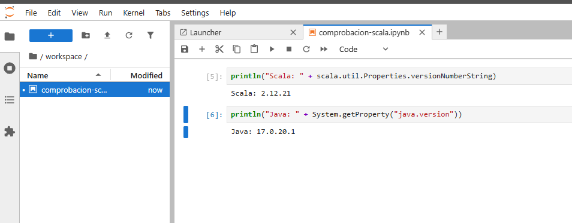

Primero definimos dos valores de texto y los utilizamos en un saludo:

```scala
val nombre = "Scala"
val version = "2.12.21"

println(s"Hola desde $nombre $version")
```

Con `val` definimos valores que no se pueden reasignar. El prefijo `s` permite insertar sus contenidos en el texto mediante `$nombre` y `$version`. La celda muestra `Hola desde Scala 2.12.21`. Almond también muestra los dos valores definidos y su tipo `String`.

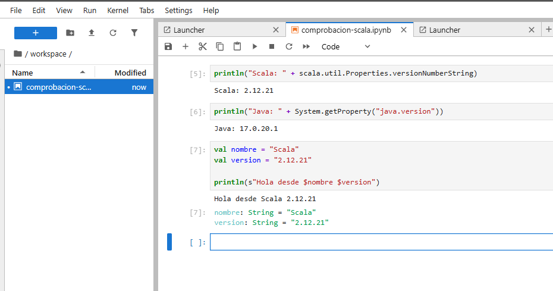

A continuación realizamos una suma en otra celda:

```scala
val a = 10
val b = 20
val resultado = a + b

println(resultado)
```

La salida es `30`. Scala deduce el tipo `Int` para los dos números y el resultado, sin necesidad de escribir el tipo en las declaraciones.

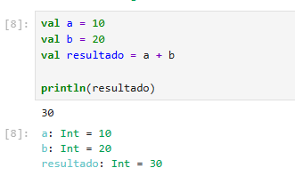

Finalmente creamos una lista de tres lenguajes:

```scala
val lenguajes = List("Scala", "Java", "Python")

println(lenguajes)
```

La salida es `List(Scala, Java, Python)`. La lista conserva el orden de los elementos y Almond muestra su tipo `List[String]`, porque contiene textos.

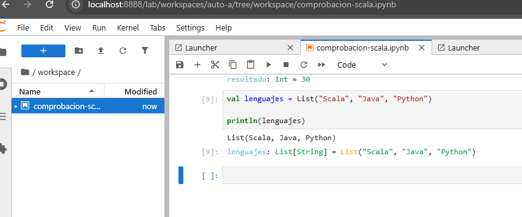

Guardamos las comprobaciones de versiones y las tres pruebas con sus salidas en [el notebook de comprobación](../workspace/comprobacion-scala.ipynb).

## 1.2 Visual Studio Code + Metals + sbt

### Instalación y configuración

Para este entorno utilizamos el JDK 17 instalado anteriormente. La comprobación con `java -version` y `javac -version` muestra 17.0.20.1 en ambos casos, como recoge la [captura de verificación del JDK](../images/08-verificacion-jdk17.png).

Visual Studio Code ya está instalado en el equipo. Abrimos una ventana nueva y consultamos Help > About para comprobar su versión: 1.137.0, con instalación de usuario (user setup).

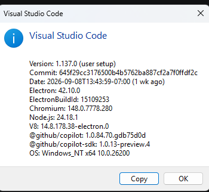

Comprobamos también la pantalla principal del editor, con el Explorador visible y sin ninguna carpeta abierta todavía.

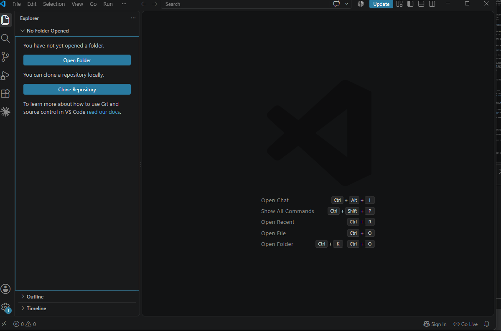

Abrimos el panel de extensiones y buscamos Scala (Metals). Identificamos la extensión de Scalameta, que muestra el botón Install.

Pulsamos Install y, al terminar, abrimos la ficha de Scala (Metals). Comprobamos que aparece Uninstall, confirmando su instalación. La ficha muestra el identificador `scalameta.metals` y la versión de la extensión 1.71.0.

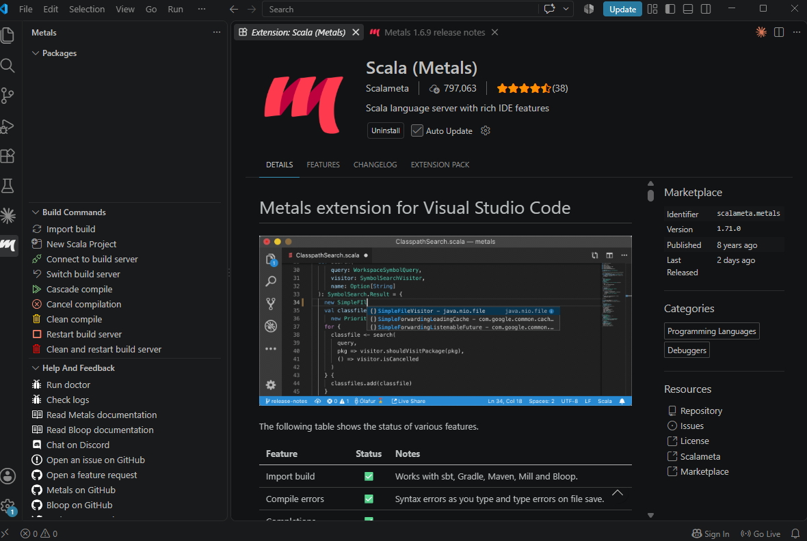

En una PowerShell nueva, desde `C:\clase3\workspace`, comprobamos la disponibilidad de sbt:

```powershell
sbt --version
```

PowerShell no reconoce `sbt`. Antes de crear el proyecto, necesitamos instalarlo y comprobar que el comando funciona.

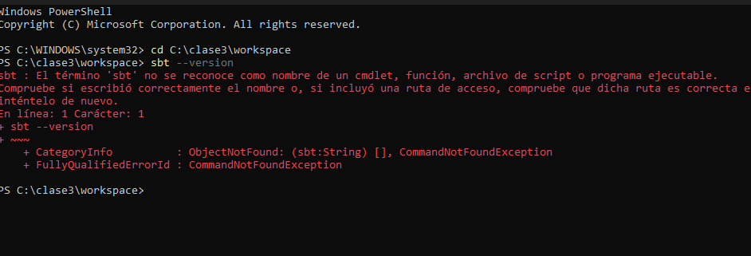

Descargamos `sbt-1.13.0.msi` desde la página oficial. Windows muestra un aviso de SmartScreen con editor desconocido; revisamos el nombre del archivo y continuamos con el instalador descargado.

En el asistente mantenemos las cuatro opciones seleccionadas, incluida Update Environment Variables, y la carpeta `C:\Program Files (x86)\sbt\`. Pulsamos Install y aparece el mensaje `Completed the sbt 1.13.0 Setup Wizard`.

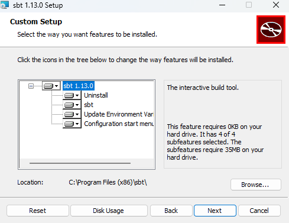

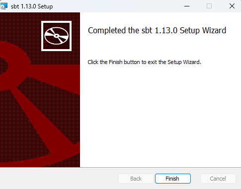

Abrimos una PowerShell nueva y ejecutamos `sbt --version` desde `C:\clase3\workspace`. Esta vez el comando responde con `sbt runner version: 1.13.0` y vuelve al prompt sin errores. La salida aclara que el runner inicia sbt y que la versión utilizada por cada proyecto se indica en `project/build.properties`.

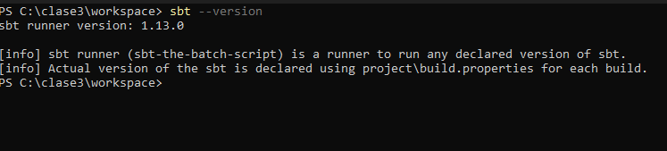

### Proyecto Scala

Creamos la carpeta `C:\clase3\workspace\scala-vscode` y entramos en ella. Después preparamos los archivos vacíos y las carpetas del proyecto:

```powershell
New-Item -ItemType Directory -Path project, src\main\scala
New-Item -ItemType File -Path build.sbt, project\build.properties, src\main\scala\Main.scala
tree /F
```

Ejecutamos los comandos uno por uno. Con `tree /F` vemos la estructura y comprobamos que están `build.sbt`, `project/build.properties` y `src/main/scala/Main.scala`. En `build.properties` fijamos después la versión de sbt.

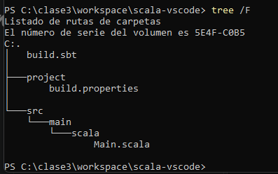

Abrimos `build.sbt` en Visual Studio Code y configuramos la versión de Scala y el nombre del proyecto:

```scala
scalaVersion := "2.12.21"
name := "scala-vscode"
```

`scalaVersion` fija la versión que utiliza el proyecto. `name` establece su nombre y `:=` asigna el valor a cada opción de sbt. Guardamos el archivo.

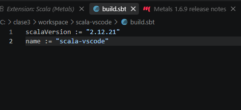

En `project/build.properties` fijamos también la versión de sbt:

```properties
sbt.version=1.13.0
```

Esta opción indica qué versión de la herramienta utiliza el proyecto. Es independiente de la versión de Scala configurada en `build.sbt`.

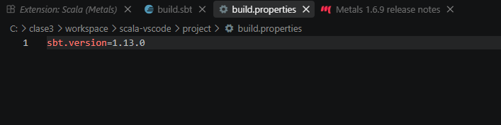

En `src/main/scala/Main.scala` escribimos y guardamos el siguiente programa:

```scala
object Main extends App {
    val entorno = "Visual Studio Code"

    println("Práctica de programación básica con Scala")
    println(s"Ejecutando desde: $entorno")
}
```

Con `object Main extends App` definimos el programa que vamos a ejecutar. Guardamos el nombre del editor en `entorno` y lo mostramos en el segundo `println` usando `$entorno`.

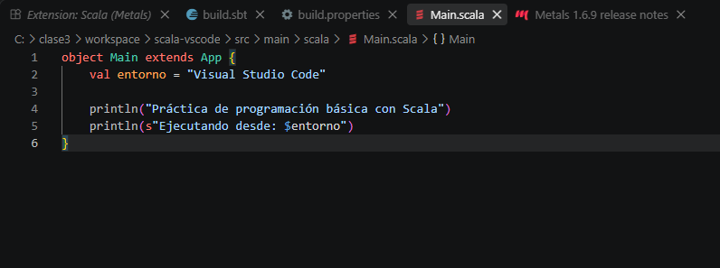

Abrimos la carpeta `scala-vscode` en Visual Studio Code y ejecutamos `Metals: Import build`. Después consultamos `Metals: Run doctor`. El diagnóstico reconoce el proyecto con Scala 2.12.21 y sbt 1.13.0, pero muestra Java 21.0.4 como JDK del proyecto. Nos queda ajustarlo a Java 17.

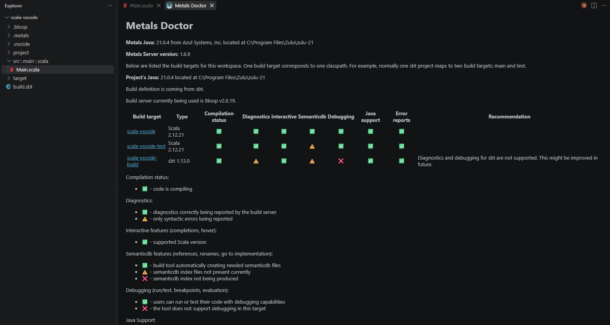

En los ajustes Workspace cambiamos `Metals: Java Home` a `C:\Program Files\Zulu\zulu-17`. Al importar de nuevo, aparece un error porque Metals no consigue conectar con Bloop dentro del tiempo de espera. Ejecutamos `Metals: Restart build server` y volvemos a abrir el diagnóstico.

Esta vez `Project's Java` muestra 17.0.20.1 y el proyecto `scala-vscode` aparece con Scala 2.12.21 y todos sus indicadores verdes. El servidor Metals sigue utilizando Java 21; su JVM es distinta del JDK seleccionado para el proyecto.

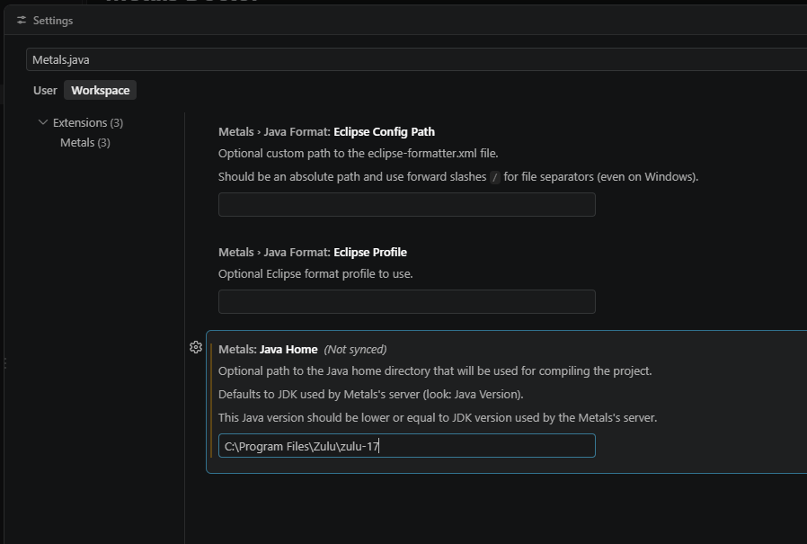

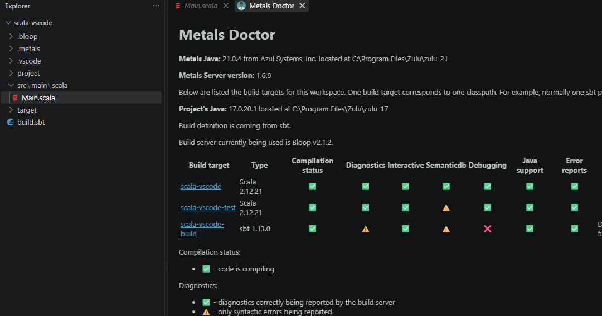

### Compilación y ejecución

Abrimos una PowerShell nueva y nos situamos en `C:\clase3\workspace\scala-vscode`. Ejecutamos:

```powershell
sbt compile
```

sbt 1.13.0 utiliza Java 17.0.20.1 y compila el archivo Scala. También prepara el puente del compilador para Scala 2.12.21. La operación termina con `[success]`, confirmando que el proyecto compila correctamente.

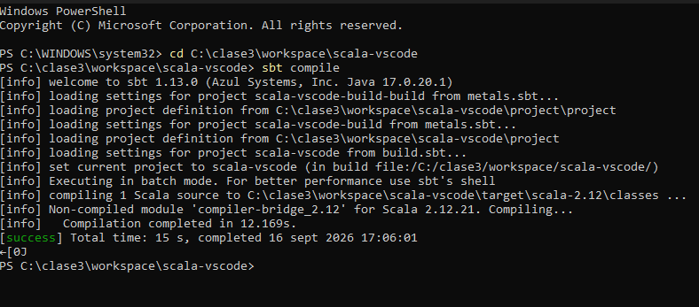

Después ejecutamos `sbt run`. El programa termina con `[success]`, pero inicialmente las tildes se muestran mal. Comprobamos que `chcp` indica 65001 y que `[Console]::OutputEncoding.WebName` todavía devuelve `ibm850`.

Probamos `chcp 65001` y añadimos `-Dfile.encoding=UTF-8 -Dsun.stdout.encoding=UTF-8` a `JAVA_OPTS`, pero las tildes siguen mal. Mantenemos esos ajustes y cambiamos también la codificación de salida de PowerShell antes de repetir la ejecución:

```powershell
[Console]::OutputEncoding = [System.Text.UTF8Encoding]::new($false)
sbt run
```

Esta vez vemos correctamente los dos mensajes y la ejecución termina con `[success]`:

```text
Práctica de programación básica con Scala
Ejecutando desde: Visual Studio Code
```

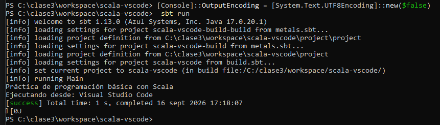

## 1.3 IntelliJ IDEA Community + sbt

### Instalación y configuración

Abrimos IntelliJ IDEA Community, que ya está instalado en el equipo. La pantalla de inicio muestra la versión 2024.3.1.1.

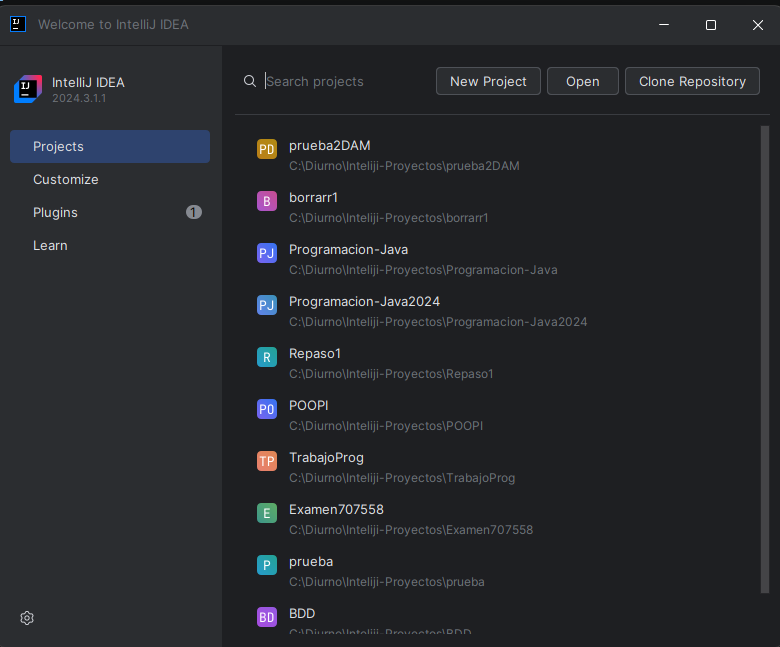

Entramos en Plugins y buscamos Scala en Marketplace. Seleccionamos el plugin de JetBrains s.r.o.; la ficha ofrece la versión 2024.3.35.

Pulsamos Install para añadir el soporte de Scala. Después comprobamos en Plugins > Installed que Scala 2024.3.35 aparece con la casilla marcada y el botón Disable, lo que indica que está instalado y habilitado.

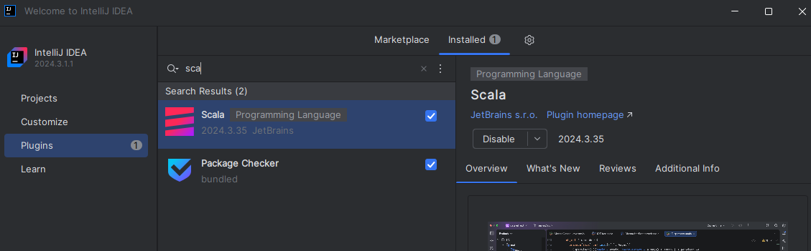

### Proyecto Scala

Creamos un proyecto llamado `scala-intellij` dentro de `C:\clase3\workspace`. Seleccionamos sbt como herramienta de construcción, Zulu JDK 17 y Scala 2.12.21. Dejamos desmarcadas las opciones de crear un repositorio Git y añadir código de ejemplo.

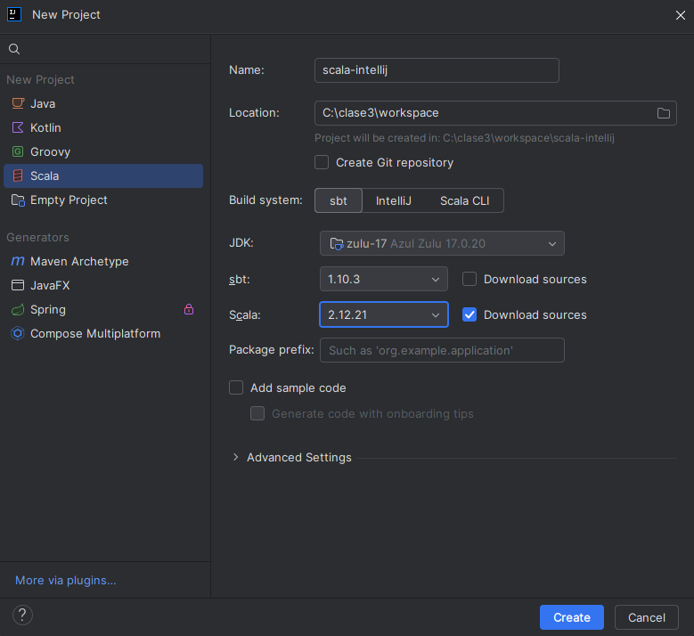

Al abrir el proyecto, comprobamos que `build.sbt` contiene `ThisBuild / scalaVersion := "2.12.21"` y `name := "scala-intellij"`. La opción `ThisBuild` establece la versión de Scala para la construcción. El archivo `project/build.properties` fija `sbt.version = 1.10.3`.

Dentro de la estructura aparece `src/main/scala`, la carpeta donde guardamos el programa.

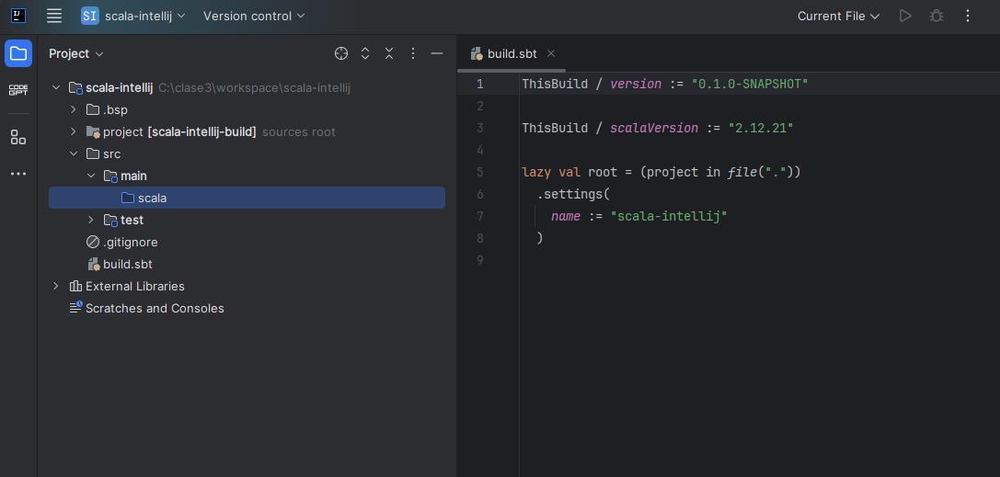

Abrimos Project Structure > Project y comprobamos que el SDK seleccionado para `scala-intellij` es Zulu 17. Dejamos el nivel de lenguaje en SDK default.

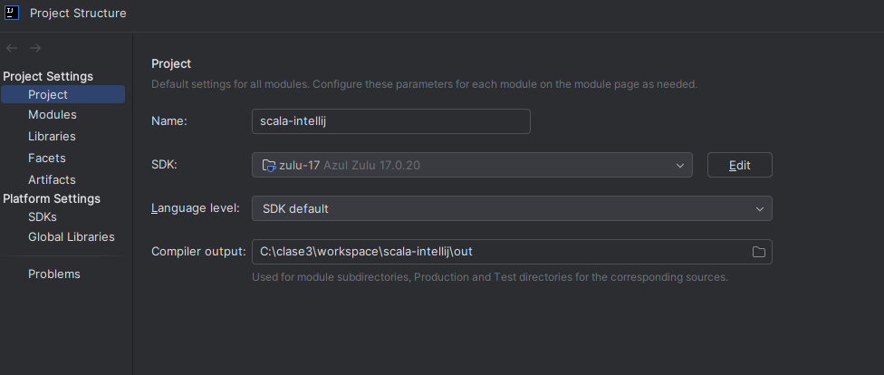

### Ejecución desde el IDE y con sbt

Creamos `src/main/scala/Main.scala` con un objeto `Main` que extiende `App`. Guardamos el nombre del entorno en `val entorno` y usamos dos instrucciones `println` para mostrar el saludo y el IDE utilizado.

Ejecutamos Main desde el botón verde del editor. Vemos los dos mensajes con las tildes correctas y, al final, `Process finished with exit code 0`. Ese código indica que el programa termina sin errores. En la primera línea de la consola también vemos que utiliza Zulu 17.

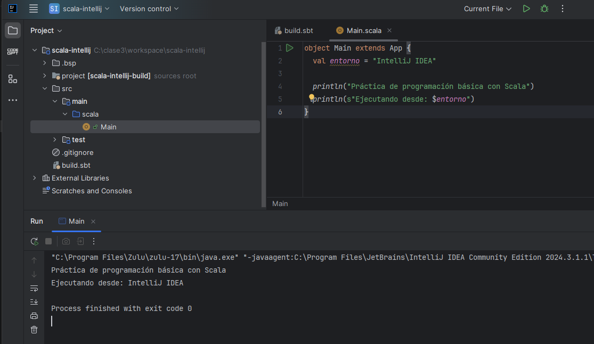

Desde PowerShell entramos en `C:\clase3\workspace\scala-intellij` y ejecutamos `sbt compile`. sbt 1.10.3 utiliza Java 17.0.20.1 y compila el programa con Scala 2.12.21. Aparece una advertencia sobre el proveedor de terminal jansi, pero la compilación termina con `[success]`.

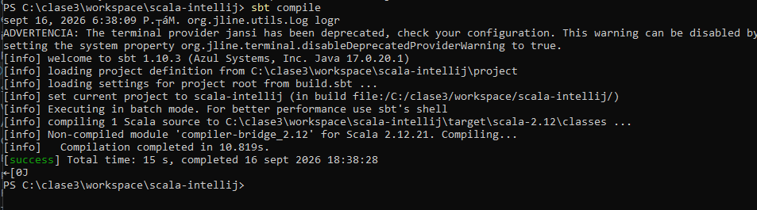

En la misma PowerShell ajustamos la salida a UTF-8 y ejecutamos el programa con sbt:

```powershell
[Console]::OutputEncoding = [System.Text.UTF8Encoding]::new($false)
sbt run
```

La consola muestra `Práctica de programación básica con Scala` y `Ejecutando desde: IntelliJ IDEA`, con las tildes correctas. La ejecución termina con `[success]`.

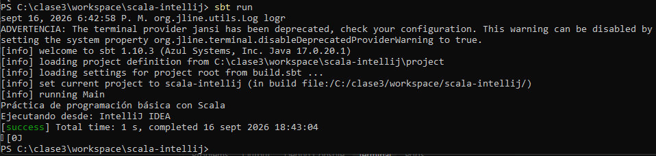

## Problemas y soluciones

Al principio ejecutamos python.exe -m pip install jupyterlab desde la carpeta Scripts. La instalación termina, pero se realiza en el Python general del equipo. Estar dentro de esa carpeta no activa el entorno virtual.

Lo corregimos repitiendo la instalación con la ruta completa del Python del entorno:

```powershell
C:\clase3\.venv\Scripts\python.exe -m pip install jupyterlab
```

Para iniciar JupyterLab desde Scripts usamos .\python.exe. El prefijo .\ indica a PowerShell que utilice el ejecutable de esa carpeta.

## Archivos de la práctica

- [Notebook de comprobación con sus resultados](../workspace/comprobacion-scala.ipynb).
- [Proyecto scala-vscode](../workspace/scala-vscode/): [build.sbt](../workspace/scala-vscode/build.sbt) y [Main.scala](../workspace/scala-vscode/src/main/scala/Main.scala).
- [Proyecto scala-intellij](../workspace/scala-intellij/): [build.sbt](../workspace/scala-intellij/build.sbt) y [Main.scala](../workspace/scala-intellij/src/main/scala/Main.scala).
- [Volver al índice principal](../README.md).
