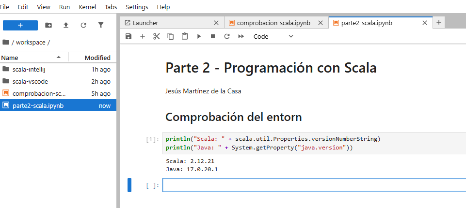
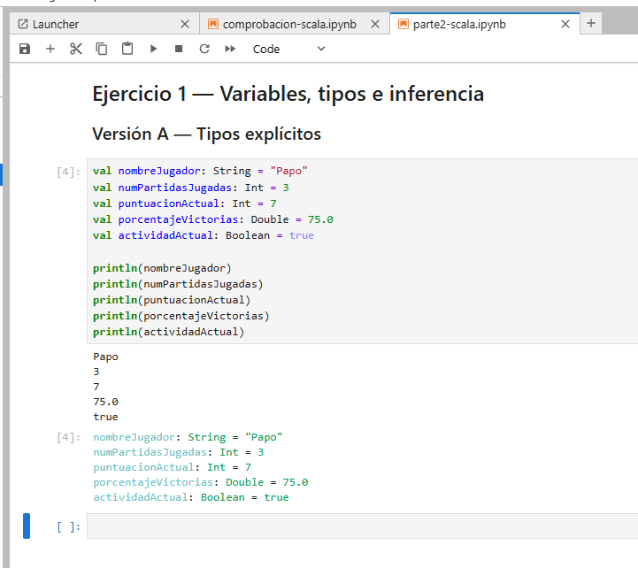
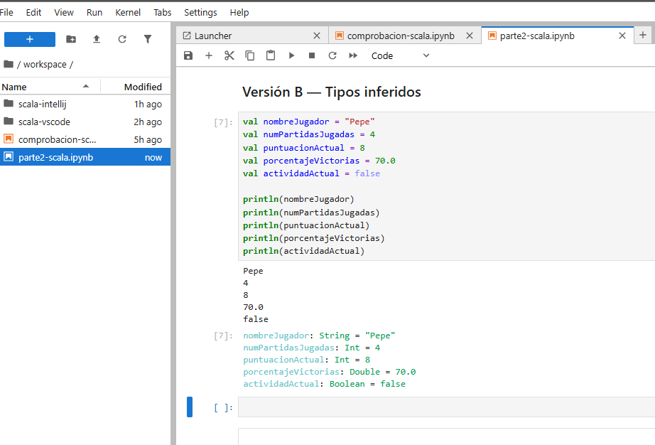
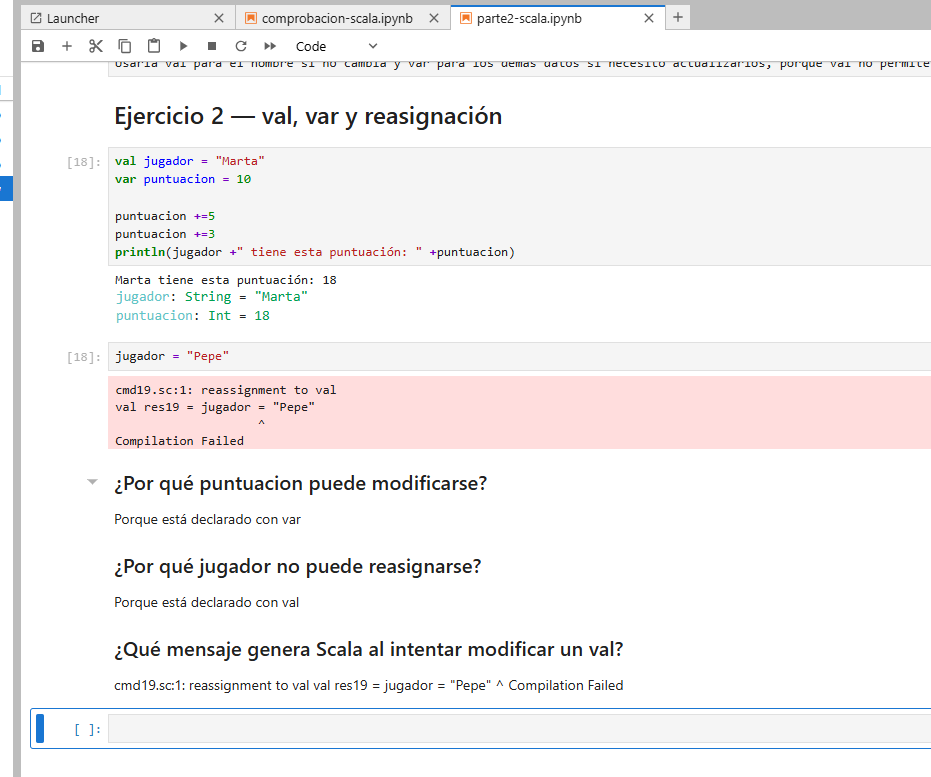
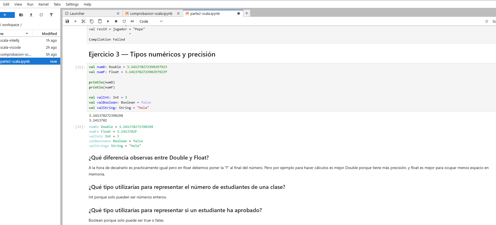
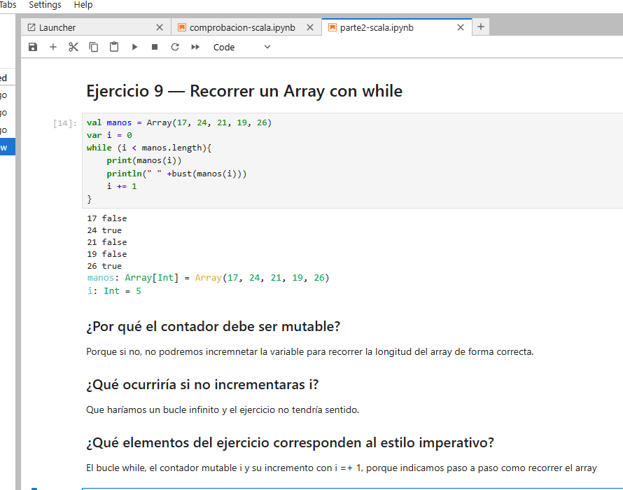
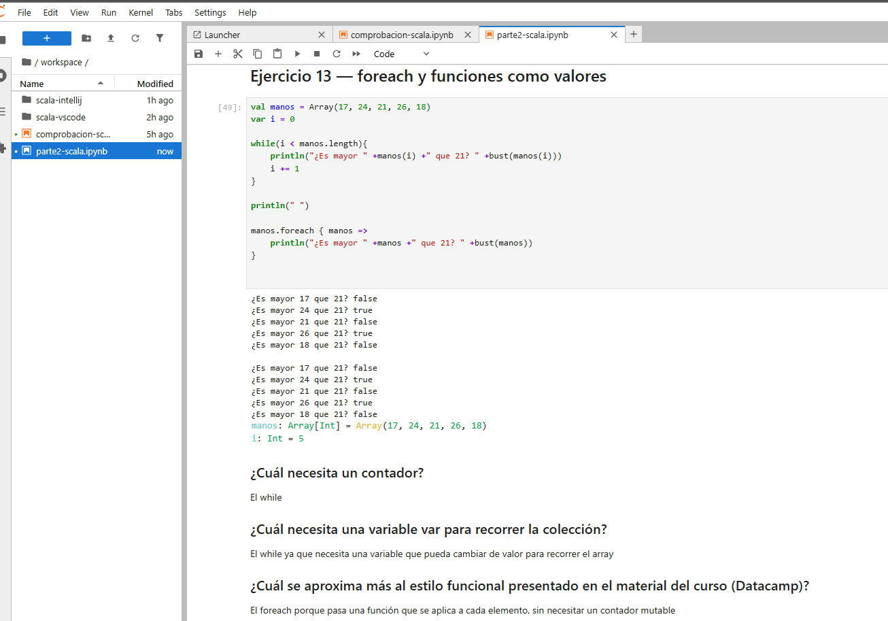
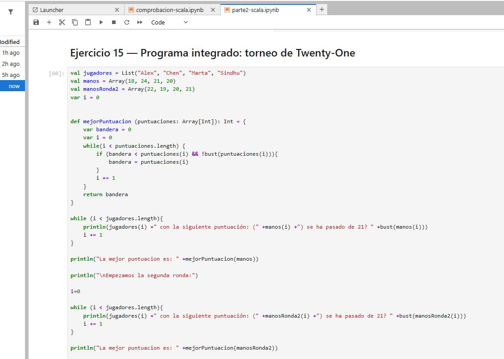
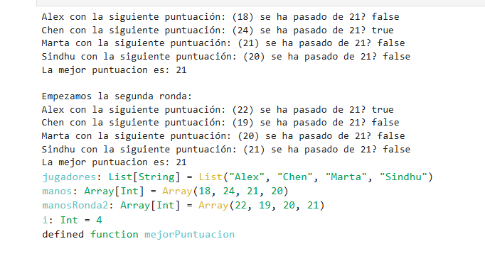

# Parte 2 — Programación con Scala

Jesús Martínez de la Casa

## Entorno y notebook

Trabajamos con JupyterLab y el kernel Almond, utilizando Scala 2.12.21 y Azul Zulu JDK 17.0.20.1. Abrimos el notebook y comprobamos las versiones en la primera celda.

[Abrimos el notebook con los quince ejercicios y sus salidas](../workspace/parte2-scala.ipynb).

## Cómo ejecutar el notebook

Seleccionamos el kernel Scala y ejecutamos las celdas de arriba abajo. Definimos `bust` en el ejercicio 4 antes de utilizarla en los ejercicios posteriores. Cada apartado incluye código, salidas y una explicación breve.

En los ejercicios 2 y 7 provocamos los errores que pide el enunciado. Intentamos cambiar el valor de un `val` e introducir un entero en un `Array[String]`. Conservamos las celdas y sus mensajes. Cuando se detiene la ejecución en uno de estos errores previstos, continuamos desde la celda siguiente.

## Contenido

| Ejercicio | Qué comprobamos |
| --- | --- |
| 1. Variables y tipos | Comparamos tipos explícitos e inferidos. |
| 2. val y var | Incrementamos una puntuación y probamos una reasignación no permitida. |
| 3. Precisión | Comparamos Double y Float y utilizamos Int, Boolean y String. |
| 4. bust | Comprobamos si 18, 21, 22 y 30 superan 21. |
| 5. maxHand | Comparamos dos manos y probamos un empate. |
| 6. ganador | Combinamos condiciones para elegir una puntuación válida. |
| 7. Arrays | Cambiamos un elemento y conservamos el error de tipos. |
| 8. Inicialización | Comprobamos ceros iniciales, asignamos valores y mostramos la longitud. |
| 9. while | Recorremos un array mediante un contador mutable. |
| 10. List | Añadimos un elemento sin modificar la lista original. |
| 11. Nil y concatenación | Construimos y unimos listas conservando las originales. |
| 12. Operadores | Evaluamos seis expresiones y explicamos sus resultados en una tabla. |
| 13. foreach | Comparamos dos formas de recorrer un array. |
| 14. Efectos secundarios | Comparamos modificar un total externo con devolver una suma. |
| 15. Dos rondas | Usamos listas, arrays, funciones y bucles en Twenty-One. |

## Variables, tipos y precisión

En el ejercicio 1 escribimos los tipos de cinco datos y mostramos sus valores. Después dejamos que Scala infiera los tipos. En ambas versiones obtenemos String, Int, Int, Double y Boolean.

En el ejercicio 2 sumamos 5 y 3 a la puntuación inicial de 10 y obtenemos 18. Al intentar cambiar `jugador`, declarado con `val`, aparece `reassignment to val`.

En el ejercicio 3 utilizamos el mismo decimal en Double y Float. Las salidas muestran que Double conserva más cifras significativas. Añadimos ejemplos de Int, Boolean y String.

## Recorridos con while y foreach

En el ejercicio 9 comprobamos `i < manos.length` y aumentamos el contador con `i += 1`. Mostramos las cinco puntuaciones y el resultado de `bust` para cada una.

En el texto de esta captura aparece `i =+ 1`. La instrucción correcta es `i += 1`, como muestra el código. La explicación del notebook utiliza la forma correcta.

En el ejercicio 13 obtenemos los mismos resultados con while y foreach. Con while necesitamos un contador que vaya cambiando. Con foreach pasamos una función que se aplica a cada mano.

## Torneo de Twenty-One

En el ejercicio 15 mantenemos los nombres en una lista y las puntuaciones en dos arrays. Con `bust` comprobamos si una mano supera 21. Con `mejorPuntuacion` recorremos los valores y conservamos el mayor que no se pasa.

Antes del segundo recorrido reiniciamos `i` a cero para mostrar también los cuatro jugadores de la segunda ronda.

En la primera ronda Chen se pasa con 24 y la mejor puntuación válida es 21, de Marta. En la segunda ronda Alex se pasa con 22 y la mejor puntuación vuelve a ser 21, de Sindhu. Los demás jugadores mantienen puntuaciones válidas en su ronda.

En las conclusiones del notebook distinguimos los contadores y arrays mutables de la lista inmutable, y explicamos dónde utilizamos funciones y estructuras de control.

[Volvemos al índice principal](../README.md).
