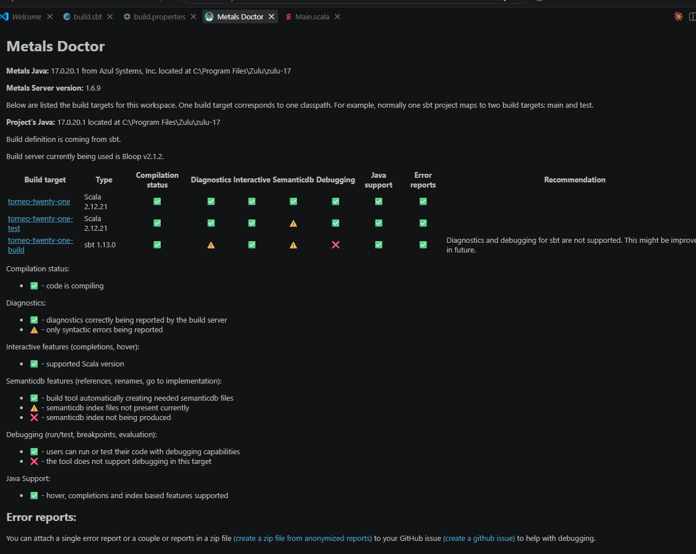
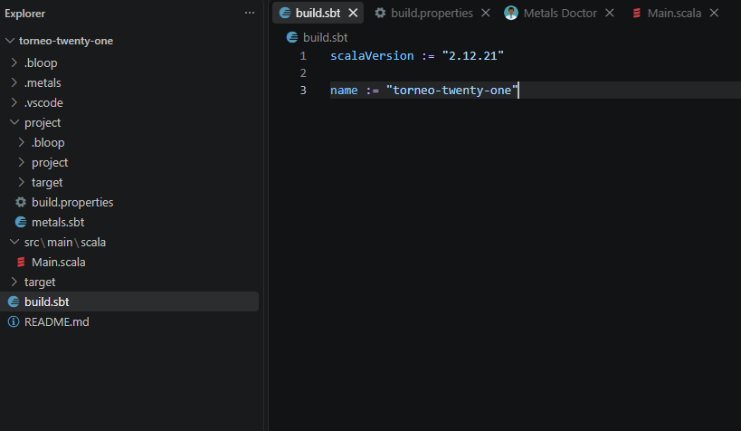
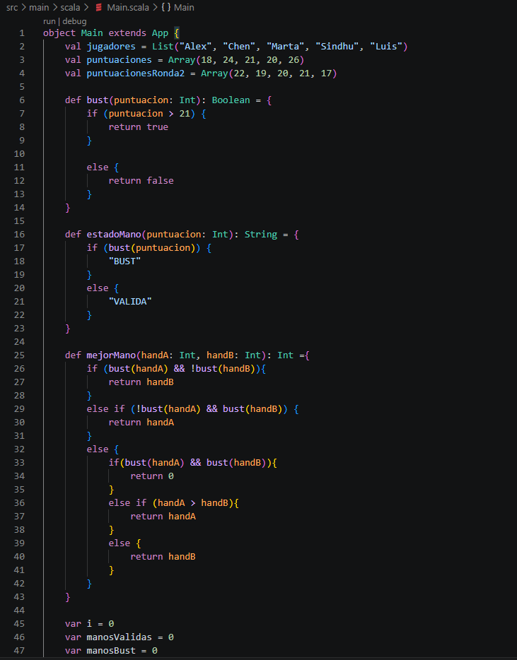
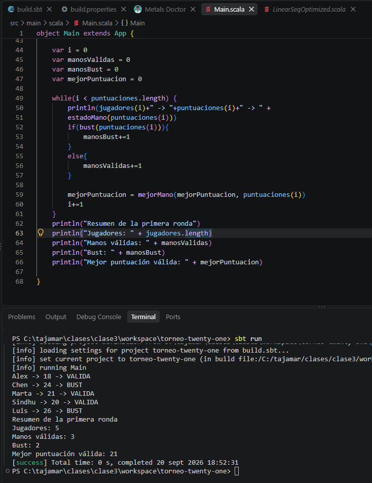
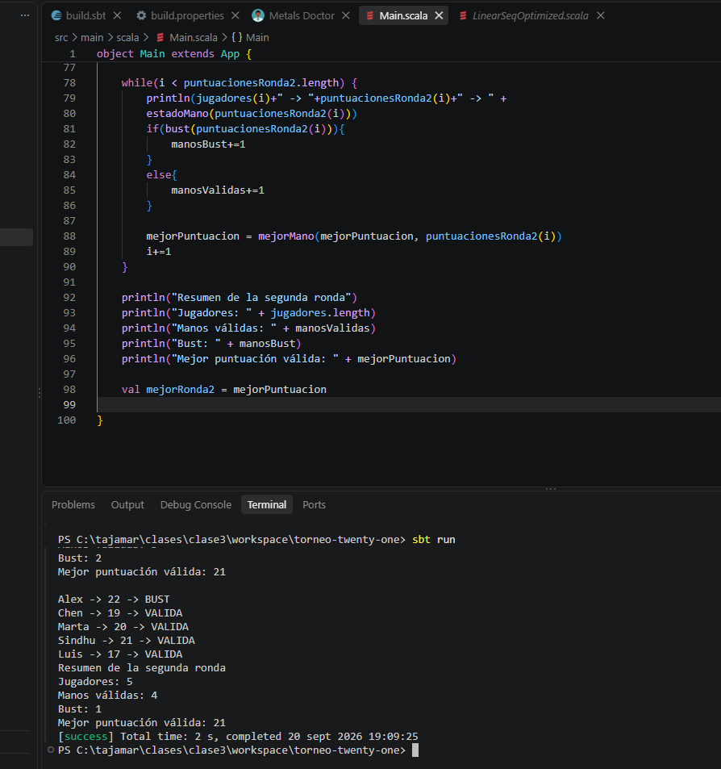
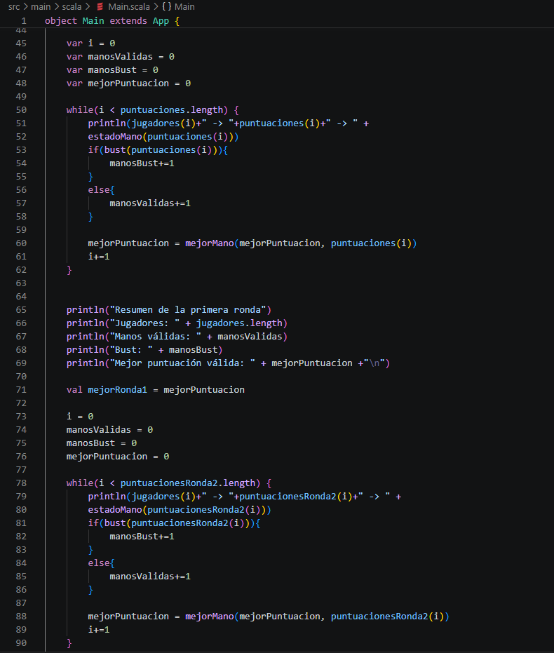
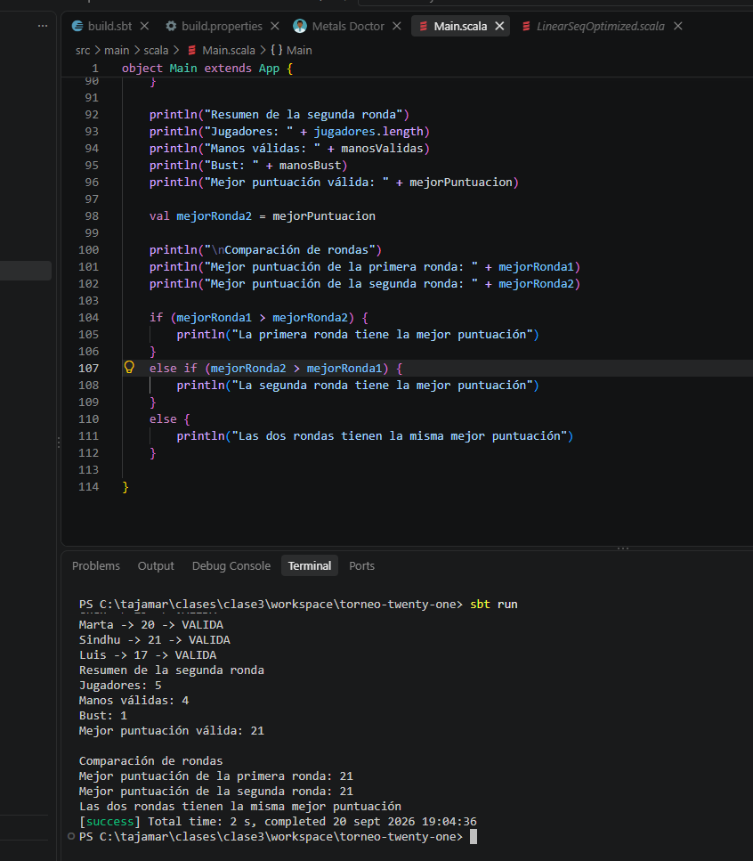
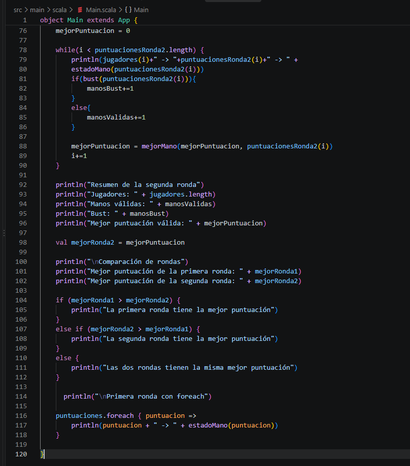
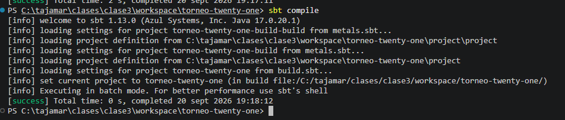

# Mini proyecto 3.1: Torneo de Twenty-One

Analizamos dos rondas de un torneo con cinco jugadores. Mostramos quién se pasa de 21, contamos las manos válidas y comparamos la mejor puntuación de cada ronda.

## Entorno

Trabajamos en Visual Studio Code con Metals, Scala 2.12.21, Zulu JDK 17.0.20.1 y sbt 1.13.0.

Después de crear los archivos ejecutamos `Metals: Import build` para que Metals reconozca el proyecto. Abrimos `Metals: Run doctor` y comprobamos que `torneo-twenty-one` aparece con Scala 2.12.21 y los indicadores en verde. El proyecto utiliza Java 17.

## Estructura

En `build.sbt` indicamos Scala 2.12.21 y el nombre `torneo-twenty-one`. En `project/build.properties` fijamos sbt 1.13.0. El código del programa va en `src/main/scala/Main.scala`.

## Datos y funciones

Guardamos los nombres en una `List` y las puntuaciones de cada ronda en un `Array`. La posición de cada puntuación coincide con la del jugador. Mantenemos la misma lista de nombres en las dos rondas.

- `bust` devuelve `true` si la puntuación supera 21.
- `estadoMano` usa `bust` para devolver `BUST` o `VALIDA`.
- `mejorMano` devuelve la mayor puntuación válida de las dos que recibe. Si ambas se pasan devuelve 0.

## Primera ronda

Recorremos las puntuaciones con un `while` y usamos la misma posición para obtener el nombre de cada jugador. Con `estadoMano` mostramos si su puntuación es válida o se pasa de 21. Contamos las manos de cada tipo y usamos `mejorMano` para guardar la mejor puntuación válida.

Al ejecutar `sbt run` obtenemos 5 jugadores, 3 manos válidas y 2 que se pasan. Marta tiene la mejor puntuación válida con 21 puntos.

## Segunda ronda

Usamos `puntuacionesRonda2` con los mismos jugadores y funciones. Antes del recorrido ponemos los contadores a cero y guardamos la mejor puntuación de la primera ronda para compararla después.

En esta ronda hay 4 manos válidas y 1 que se pasa. Sindhu consigue la mejor puntuación con 21 puntos.

## Comparación de rondas

Comparamos `mejorRonda1` y `mejorRonda2` con `if`, `else if` y `else`. Las dos valen 21, así que mostramos que ambas rondas tienen la misma mejor puntuación.

## Comparación de while y foreach

Con `while` usamos el contador `i` para recorrer las posiciones y lo aumentamos en cada vuelta. Con `foreach` trabajamos directamente con cada puntuación sin un contador mutable. Esta segunda forma se acerca más al estilo funcional porque pasamos una función que se aplica a cada elemento.

Al ejecutar esta versión obtenemos los mismos estados de la primera ronda. Las puntuaciones 18, 21 y 20 son válidas. Las de 24 y 26 se pasan.

## Compilación y ejecución

Desde la terminal integrada de Visual Studio Code, dentro de la carpeta del proyecto, ejecutamos `sbt compile` para compilar y `sbt run` para arrancar el programa. La compilación termina con `[success]`.

## Problemas y soluciones

Al principio las tildes salen mal en la terminal. Añadimos `[Console]::OutputEncoding = [System.Text.UTF8Encoding]::new($false)` al perfil de Windows PowerShell para usar UTF-8 al abrir una sesión. Abrimos una terminal nueva y repetimos `sbt run`. Ahora las tildes se muestran correctamente.
